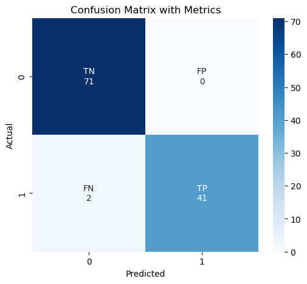
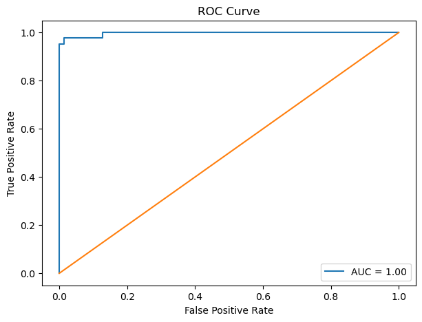

# Breast Cancer Classification Project

## Overview
This project uses Machine Learning to classify breast tumors as:
- Benign
- Malignant

using the Breast Cancer Wisconsin Dataset.

## Technologies Used
- Python
- Pandas
- NumPy
- Scikit-learn
- Streamlit
- Matplotlib
- Seaborn

## Machine Learning Workflow
- Data Cleaning
- Exploratory Data Analysis (EDA)
- Feature Scaling
- Feature Selection
- Logistic Regression
- Model Evaluation
- ROC Curve Analysis

## Model Performance
- Training Accuracy: 98.46%
- Testing Accuracy: 98.24%
- AUC Score: 1.00

## Project Files
- `breast_cancer_classification.ipynb`
- `app.py`
- `breast_cancer_pipeline.pkl`

## Visualizations

### Confusion Matrix


### ROC Curve


## Run The Application

```bash
streamlit run app.py
```
